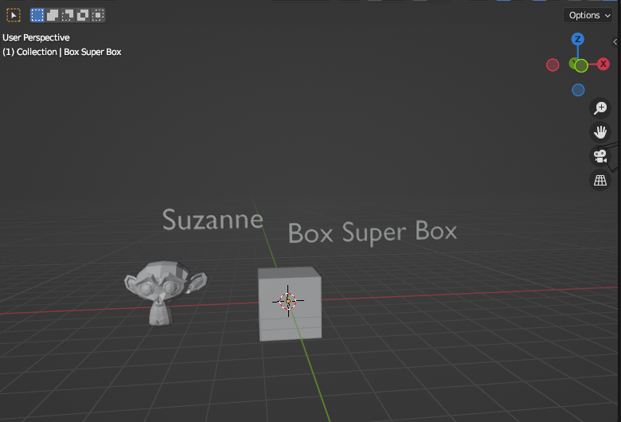

# blender-object-name-text

This Blender Script creates the name of the selected object above it as a signature on the map at a height of 3 units along the Z axis with a 90-degree rotation relative to the X axis

## Draft version

